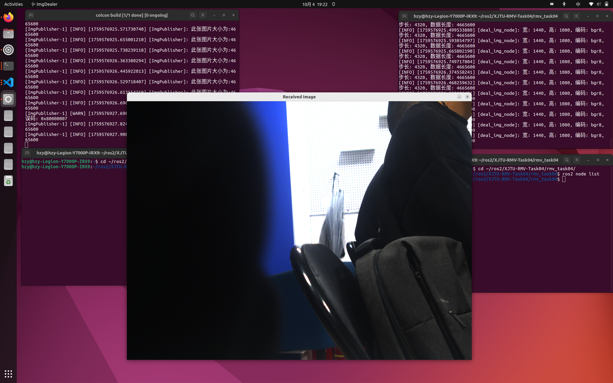
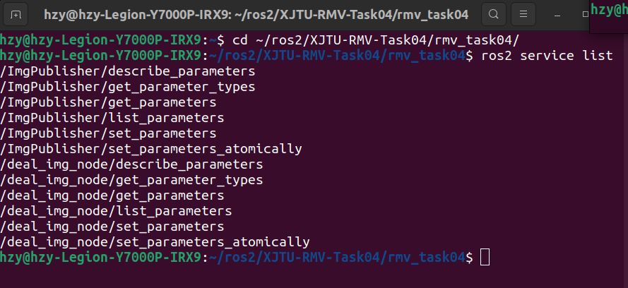
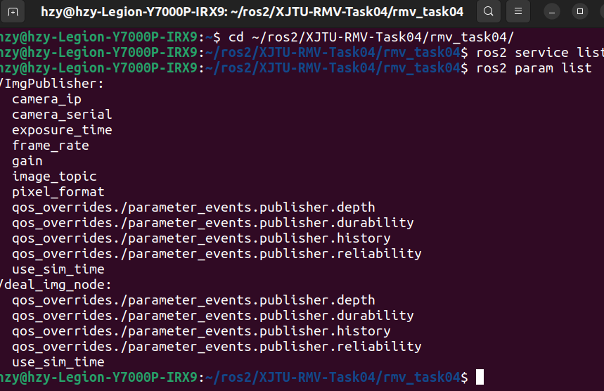
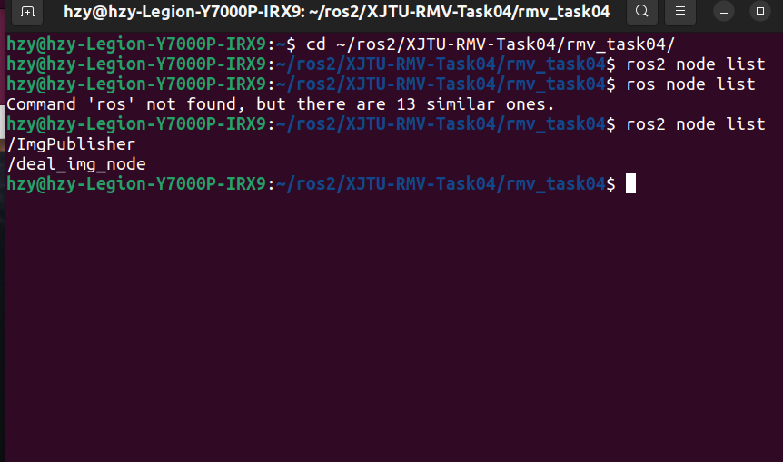
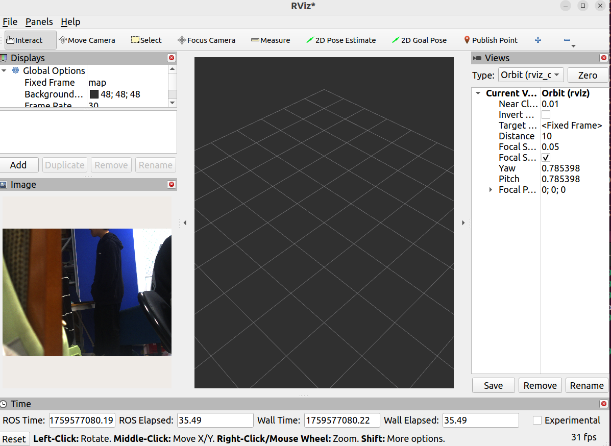
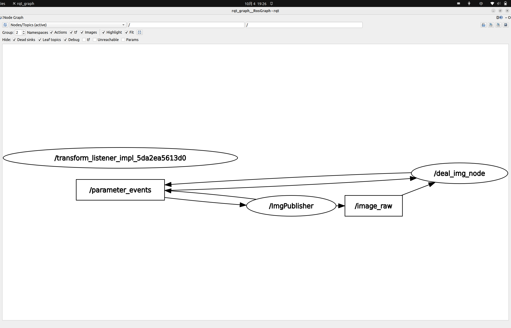

# XJTU_RMV_Task4

### 项目说明
* 实现了两个节点ImgPublisher,ImgDealer前者用来发布img信息到topic上，后者从topic上接收信息调用Opencv库进行处理
* 自定义了两个param接口，Object  ObjectArray主要是ImgDealer调用Opencv库处理后给出目标轮廓的坐标以及信息(不过目前还给的是像素坐标，未做一些实际坐标)
### 功能展示
##### ImgDealer节点

##### Service

##### Param

##### Node

##### rviz2

##### rqt_graph



### 目录介绍
``` bash
src/
├── img_dealer.cpp    ImgDealer节点源文件
├── img_publisher.cpp  ImgPublilsher节点源文件
└── main.cpp       仿照海康威视开发手册中的取流过程

msg   定义的两个接口
├── ObjectArray.msg
└── Object.msg

launch/  py配置的launch文件
└── launch.py

learn/   学习ros2写的几个示例topic,service,param
├── example_ros2_interfaces
├── example_service_rclcpp
└── example_topic_rclcpp

```
